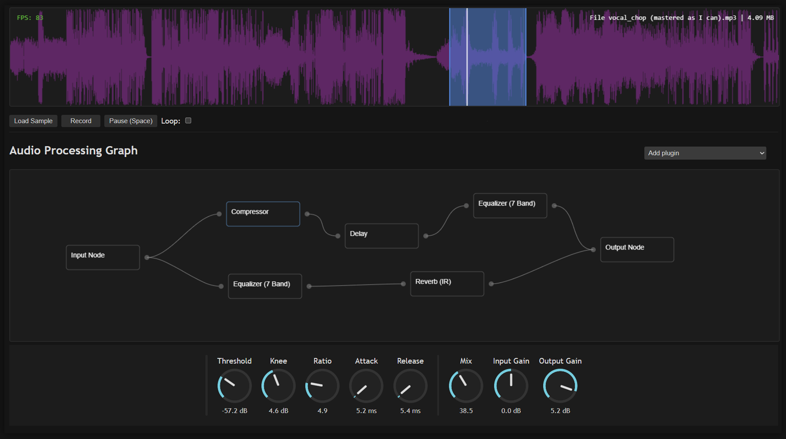

Web Audio FX is a simple audio processing web application that allows you record, upload an audio and mix it with a bunch of audio effects using Web Audio API.
Plugins are managed using the build-in Node Graph editor.

You can try it here: https://usein-abilev.github.io/web-audio-fx



## Installation

1. Clone the repository
```bash
git clone https://github.com/usein-abilev/web-audio-fx.git
cd ./web-audio-fx
```

2. Install dependencies
```bash
npm i
```

3. Run
```bash
npm run dev
```

## Contributing
Contributions, ideas and bug reports are welcome! Feel free to open issues or pull requests.
