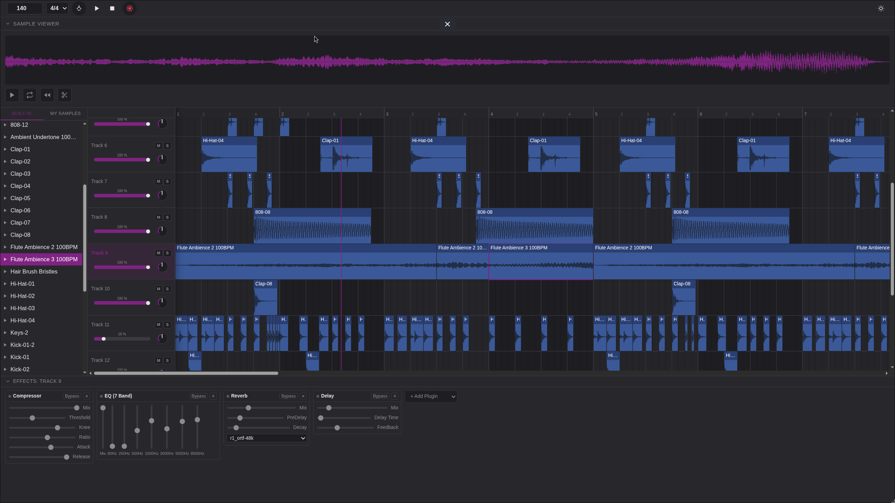

**Web Audio FX** is a browser-based audio workstation built with Svelte 5, and the native Web Audio API. Runs entirely client-side with no server dependencies — user recordings and uploads persist via IndexedDB.

You can try it here: https://usein-abilev.github.io/web-audio-fx



## Features

- Multi-track SVG timeline with grid-snapped clip placement
- Per-track effects rack (convolution reverb with 27 real-world impulse responses, 7-band EQ, delay, compressor)
- 15 tracks with independent gain, pan, mute, and solo controls
- Look-ahead scheduler for beat-accurate playback
- Built-in sample library with microphone recording
- User recordings and uploads persist via IndexedDB

## Installation

1. Clone the repository
```bash
git clone https://github.com/usein-abilev/web-audio-fx.git
cd ./web-audio-fx
```

2. Install dependencies

```bash
npm i
```

3. Run

```bash
npm run dev
```

## Credits & Licensing
- Impulse Responses & Anechoic Samples - [OpenAir Library](https://www.openairlib.net/) (University of York), licensed under [CC BY 4.0](https://creativecommons.org/licenses/by/4.0/)
- Signature Sounds - [signaturesounds.org](https://signaturesounds.org), licensed under [CC0 1.0](https://creativecommons.org/publicdomain/zero/1.0/)

See [CREDITS](CREDITS) for full attribution details.

## Contributions
Contributions, ideas and bug reports are welcome! Feel free to open issues or pull requests.
